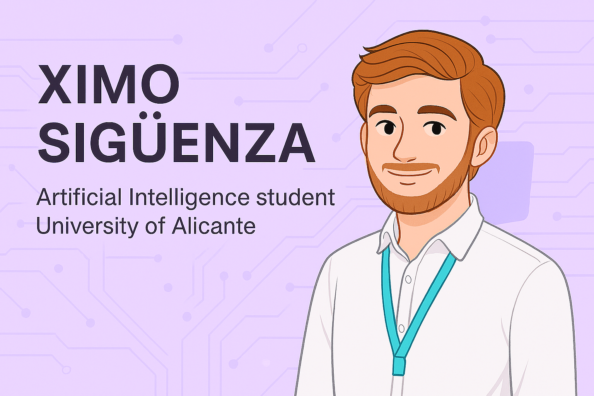

# 👋 Hi there! I'm Ximo

---

🎓 Artificial Intelligence Engineering student at the University of Alicante.  
💡 Passionate about intelligent systems development, backend programming with Python, and designing efficient automated solutions.  
🔍 Currently studying Kalman Filters, fuzzy logic, and decision-making architectures.

---
## 🧠 Technological Skills

Throughout my education and personal projects, I’ve worked with a variety of technologies. Here’s a summary:

| What I use | What I want to learn |
|------------|----------------------|
|         |      |

### 🧰 Systems & Tools

| Operating Systems | Databases | IDEs & Version Control |
|------------------|-----------|------------------------|
|   |    |     |

### 🎯 Other

| Virtualization | Documentation |
|----------------|----------------|
|   |   |

---
## 🚀 Featured Projects *(in progress — coming soon)*

- 🤖 **Fuzzy Expert System for Navigation**  
  Fuzzy logic-based decision making for orientation and obstacle avoidance in dynamic environments.

- 🧠 **Smart Controller for Mobile Robot**  
  Kalman Filter integration with heuristics for efficient and robust motion.

- 👾 **Autonomous Game AI Simulation**  
  Reinforcement learning policies applied to a simplified Pac-Man-like environment.

- 🌐 **3D Point Cloud Visualizer**  
  A complete CLI and 3D viewer for `.pcd` files, supporting statistical comparison between voxel grids and adaptive octrees.  
  Includes interactive visualization with [PyVista](https://docs.pyvista.org/) for LIDAR-like data analysis and debug overlays.

> *(These repositories will be published soon. Stay tuned!)*

---

## 📈 GitHub Stats

---

## 📫 Contact

- 📍 Alicante, Spain  
- 💼 [LinkedIn](https://www.linkedin.com/in/josich)  
- 📬 Email: `221833789+Quimett@users.noreply.github.com`

---

> ⚙️ This profile is a continuous work in progress — always something new to learn, build, or sometimes break.
